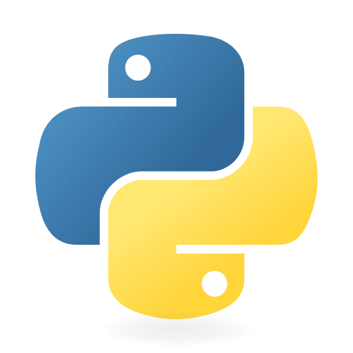
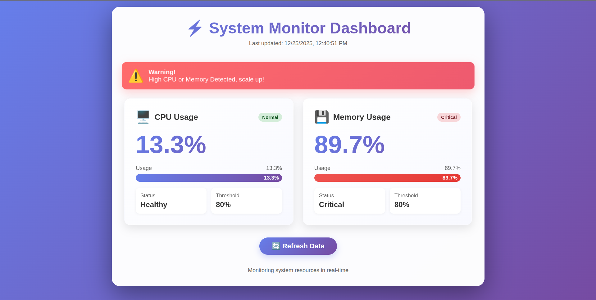

# 🖥️ System-Performance-Monitor

**A real time system monitoring dashboard built with Python flask which displays CPU and Memory usage in interactive way.**




## 🗒️ Features

- **Real-time-Monitoring**: Track CPU and Memory usage in Real-time.
- **Interactive Dashboard**: Modern elengant looking UI with smooth experience and animations.
- **Alert System**: Shows warning when the CPU or Memory usage exceeds 80%.
- **Auto refresh**: Dashboard automatically gets updates every 5 seconds.
- **Color-coded-status**: Visual indicators for Normal, Warning and Criticial states.
- **Mobile-Responsiveness**: Work seamlessly on mobile and desktop.


## 🚀 Demo


## 📦 Installation

### Prequisites

- Python 3.8 or higher
- pip (Python package manager)

### Setup

1. **Clone the repository**
``` bash 
git clone https://github.com/amandev-x/system-performance-monitoring.git

cd system-performance-monitoring
```

2. **Create a Virtual Environment**
``` bash
python3 -m venv .venv
```

3. **Activate the virtual environment**

On Linux/Mac
``` bash
source .venv/bin/activate
```

 On Windows
``` bash
venv\Scripts\activate
```

4. **Install required packages**
``` bash
pip3 install requirements.txt
```

## 🎯 Usage
1. **Run the application**
``` bash
python3 monitor.py
```

2. **Open your browser** and navigate to
``` bash
http://localhost:5001
```

## 📁 Project Structure 

```
system-performance-monitoring/
├── monitor.py # Main Flask application
├── templates/
│   └── index.html        # Dashboard HTML template
├── .venv/                # Virtual environment (not in repo)
├── README.md             # Project documentation
└── requirements.txt      # Python dependencies
```

## 🛠️ Technologies Used

- **Backend**: Python, Flask
- **Monitoring**: psutil
- **Frontend**: HTML5, CSS3, JavaScript
- **Styling**: Custom CSS with gradients and animations

## 📊 How It Works

1. **Backend**: Flask server uses `psutil` library to collect system metrics
2. **Data Processing**: Checks if CPU or memory usage exceeds 80% threshold
3. **Rendering**: Passes metrics to Jinja2 template for display
4. **Frontend**: JavaScript handles dynamic updates and visual feedback
5. **Auto-refresh**: Page reloads every 5 seconds for real-time monitoring


## 🐋 Run with Docker


**Make sure that you have docker installed already on your system.**

**Run this docker command**
```
docker run -d --name monitor -p 5001:5001 amandabral9954/system-monitor:1.1
```


## ⚙️ Configuration

You can customize the following in `monitor.py`:

```python
# Change the port
app.run(debug=True, host="0.0.0.0", port=5001)

# Modify alert threshold (currently 80%)
if cpu_percent > 80 or mem_percent > 80:
    Message = "High CPU or Memory Detected, scale up!"
```

## 🎨 Customization

### Change Auto-refresh Interval

Edit `index.html` (line ~300):
```javascript
// Change 5000 (5 seconds) to your preferred interval
setTimeout(() => {
    location.reload();
}, 5000);
```
### Modify Alert Thresholds

Edit the JavaScript status function to change color thresholds:
```javascript
if (metric > 80) {        // Critical - Red
if (metric > 60) {        // Warning - Yellow
else {                    // Normal - Green
```

## 🤝 Contributing

Contributions are welcome! Here's how you can help:

1. Fork the repository
2. Create a new branch (`git checkout -b feature/improvement`)
3. Make your changes
4. Commit your changes (`git commit -am 'Add new feature'`)
5. Push to the branch (`git push origin feature/improvement`)
6. Create a Pull Request

## 📝 Requirements

Create a `requirements.txt` file:
```txt
Flask==3.0.0
psutil==5.9.6
```

Install all dependencies:
```bash
pip install -r requirements.txt
```

## 🐛 Troubleshooting

### Template Not Found Error
Make sure `index.html` is in the `templates/` folder:
```bash
mkdir templates
mv index.html templates/
```

### Port Already in Use
Change the port in `app.py`:
```python
app.run(debug=True, host="0.0.0.0", port=5002)
```

### Permission Denied (Linux)
Run with sudo or change to a port above 1024:
```bash
python app.py  # Uses port 5001 by default
```

## 📄 License

This project is licensed under the MIT License - see the [LICENSE](LICENSE) file for details.

## 👤 Author

**Aman Dabral**

- GitHub: [@amandev-x](https://github.com/amandev-x)
- Project Link: [System-Performance_Monitor](https://github.com/amandev-x/system-performance-monitor.git)

## 🙏 Acknowledgments

- Flask framework for the web server
- psutil library for system metrics
- The open-source community

⭐ **If you found this project helpful, please give it a star!** ⭐


